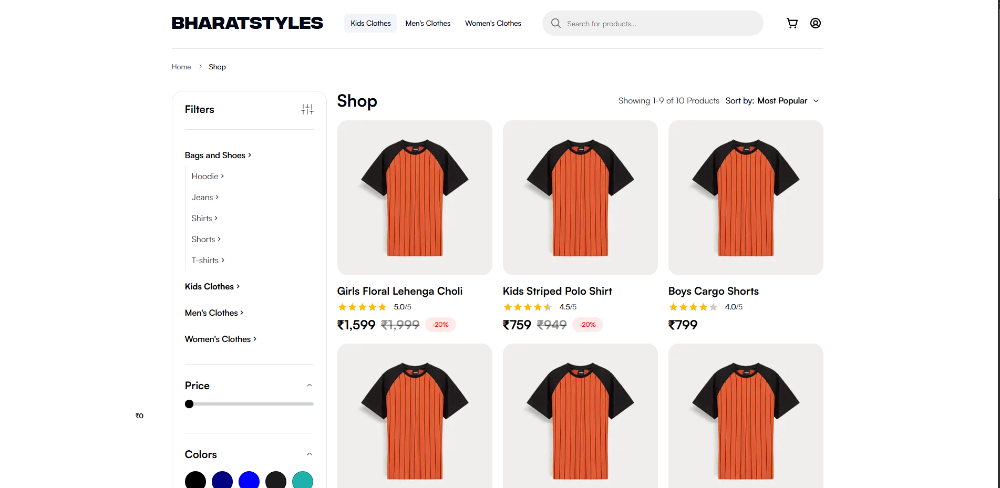
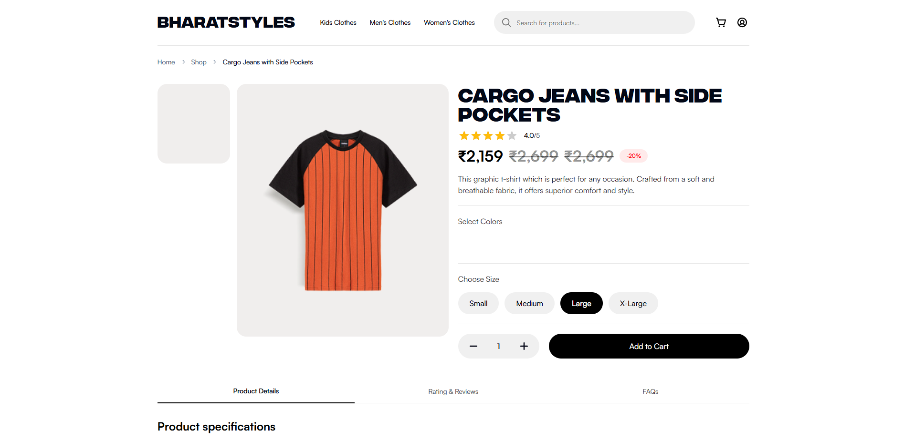
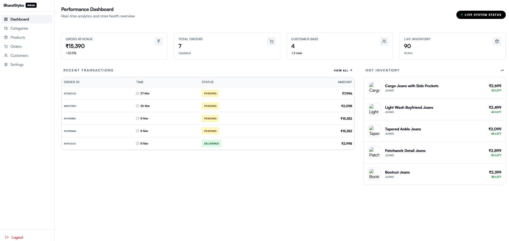

# 🛍️ BharatStyle – Full-Stack E-Commerce Platform

[](https://nextjs.org/)
[](https://tailwindcss.com/)
[](https://www.mongodb.com/)
[](https://redux-toolkit.js.org/)

A high-performance, full-stack e-commerce platform. This project utilizes the **Shop.co** UI as a core template, which I have significantly updated, optimized, and integrated with a custom-built backend.

> **Note:** Originally a frontend-only design, I have re-engineered this into a complete full-stack application (BharatStyle), implementing a robust backend architecture, secure authentication, and advanced performance optimizations.

---

## 📸 Project Screenshots

### 🏠 Home Page


### 🛍️ Shop Page & Filters


### 📦 Product Details


### 🛠️ Admin Dashboard


---

## ✨ Key Features

### 🛒 Customer Experience
- **Advanced Product Discovery**: Seamless filtering by category, price range, color, and size.
- **Dynamic Cart Management**: Real-time cart updates with persistent storage using Redux Persist.
- **Secure Checkout**: Streamlined multi-step checkout process with order tracking.
- **User Authentication**: OTP-based login and profile management using NextAuth.js.
- **Product Reviews & FAQs**: Interactive sections for social proof and product details.

### 🛠️ Admin Dashboard
- **Real-time Analytics**: Dashboard overview with key performance metrics (stats).
- **Inventory Management**: Full CRUD operations for products, categories, and brands.
- **Order Tracking**: Manage and update customer order statuses.
- **Site Settings**: Centralized control for global site configurations and reviews.

---

## ⚙️ Technical Highlights & Optimizations

This project goes beyond a simple e-commerce site by implementing enterprise-level optimizations:

### ⚡ Batch API Architecture
Implemented a custom **Batch API Route** (`/api/batch`) that allows the frontend to fetch multiple resources (e.g., New Arrivals, Top Selling, and Reviews) in a **single round-trip**. This significantly reduces latency and improves the Time to First Byte (TTFB).

### 🔒 Secure Data Transmission
Sensitive API responses are protected using **AES Encryption** (`crypto-js`). This ensures that data remains secure during transit, preventing unauthorized access even if the network is intercepted.

### 📦 Client-Side Performance
- **API Caching**: Built a custom `apiRequest` utility with an integrated in-memory cache to prevent redundant network calls for identical GET requests.
- **Optimized Asset Delivery**: Leveraged Next.js `Image` component and custom font loading strategies (Satoshi, Integral CF) for a 100/100 Lighthouse score potential.
- **Component Reusability**: Developed a modular UI library using **Radix UI** and **shadcn/ui** patterns.

### 🏗️ Robust State Management
Utilized **Redux Toolkit** with **Redux Persist** to ensure a seamless user experience, keeping the shopping cart and user preferences consistent across page refreshes and sessions.

---

## 🛠️ Tech Stack

- **Frontend**: Next.js 14 (App Router), React 18, Tailwind CSS, Framer Motion
- **Backend**: Next.js API Routes, Mongoose (MongoDB)
- **State Management**: Redux Toolkit, Redux Persist
- **Authentication**: NextAuth.js (MongoDB Adapter), OTP Verification
- **UI Components**: Radix UI, Lucide Icons, Embla Carousel
- **Utilities**: Crypto-JS (Security), Holy Loader, Validator

---

## 🛠️ Local Setup & Installation

1. **Clone the repository:**
   ```bash
   git clone https://github.com/your-username/ecommerce-nextjs.git
   cd ecommerce-nextjs
   ```

2. **Install dependencies:**
   ```bash
   npm install
   ```

3. **Configure Environment Variables:**
   Copy the example environment file and update it with your own credentials:
   ```bash
   cp .env.example .env
   ```
   *Required variables include:*
   - `MONGODB_URI`: Your MongoDB connection string.
   - `NEXTAUTH_SECRET`: Secret used by NextAuth for session encryption.
   - `NEXT_PUBLIC_API_ENCRYPTION_KEY`: A 32-character key for API data encryption.
   - `GOOGLE_CLIENT_ID` & `GOOGLE_CLIENT_SECRET`: Credentials for Google OAuth (optional).

4. **Seed the Database (Optional):**
   ```bash
   npm run seed
   ```

5. **Run the development server:**
   ```bash
   npm run dev
   ```
